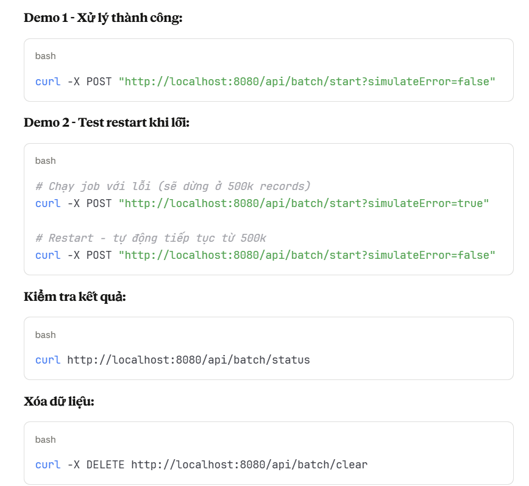
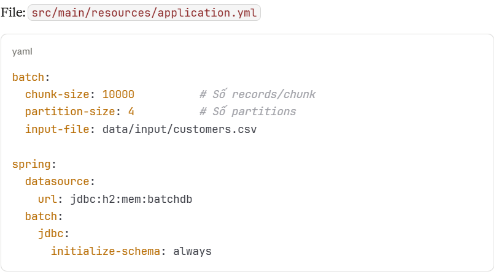
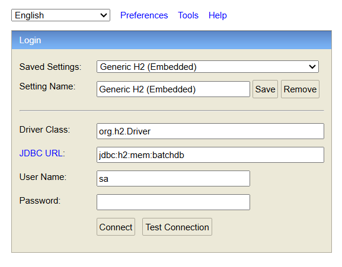
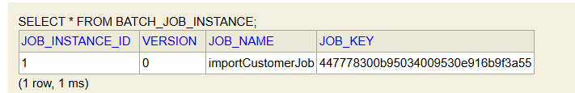
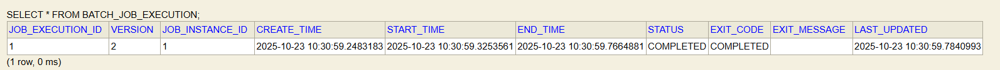
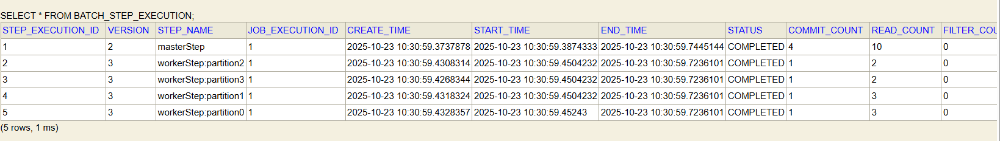
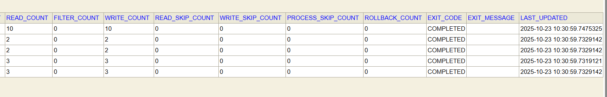
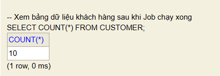

Spring Batch Demo - Xử lý dữ liệu lớn với Partitioning
Demo xử lý 10 records với khả năng phân vùng song song và phục hồi tự động. (đây là chỉ thử nghiệm để hình như đặc điểm mà spring batch xử ly - nếu muốn dữ liệu lớn hơn và util/Datagenerator để chỉnh sửa)
Yêu cầu

Java 17+
Maven 3.6+
RAM 2GB

Cài đặt
bash# Clone project
git clone git@github.com:TienDat-30404/spring-batch-partitioning.git
cd spring-batch-partitioning

# Build
mvn clean install

Chạy Demo
Bước 1: Tạo dữ liệu test
bash# Cách 1: Dùng Maven
mvn exec:java -Dexec.mainClass="com.example.spring_batch.util.DataGenerator"

Kết quả: File data/input/customers.csv với 1 triệu dòng (~130MB)

Bước 2: Start ứng dụng
mvn spring-boot:run

Bước 3: Trigger Job

Cơ chế hoạt động
1. Partitioning (Phân vùng)
File 1M records
    ↓
Chia thành 4 phần
    ↓
┌────────┬────────┬────────┬────────┐
│ 0-250k │250-500k│500-750k│750k-1M │
└────────┴────────┴────────┴────────┘
    ↓       ↓       ↓       ↓
Xử lý song song (4 threads)
    ↓
Ghi vào Database
Hiệu quả: Giảm thời gian từ 180s → 45s (4x nhanh hơn)
2. Chunking

Đọc 10,000 records
Xử lý và validate
Commit 10,000 records vào DB
Lặp lại cho đến hết

Lợi ích: Transaction an toàn, không bị quá tải memory
3. Restartability
Spring Batch lưu metadata vào các bảng:

BATCH_JOB_INSTANCE
BATCH_JOB_EXECUTION
BATCH_STEP_EXECUTION

Khi job fail → restart → tự động tiếp tục từ chunk cuối cùng thành công.
Chức năng chính
1. Reader (FlatFileItemReader)

Đọc file CSV từng dòng
Parse thành object Customer
Hỗ trợ skip header

2. Processor (CustomerItemProcessor)

Validate dữ liệu (email, firstName)
Chuẩn hóa string (uppercase, trim)
Tính toán business logic (phân loại VIP/PREMIUM/STANDARD)
Skip records lỗi

3. Writer (JdbcBatchItemWriter)

Batch insert vào database
Transaction per chunk
Auto rollback khi lỗi

4. Partitioner (RangePartitioner)

Đếm số dòng trong file
Chia đều thành N phần (config: 4)
Gán mỗi phần cho 1 worker thread

Cấu hình

 
Kiểm tra Database
Truy cập H2 Console: http://localhost:8080/h2-console
Connection:

Queries:
sql-- Xem dữ liệu

-- Xem thông tin về phiên bản công việc duy nhất
SELECT * FROM BATCH_JOB_INSTANCE;

-- xem lịch sử chi tiết về từng lần công việc (Job) được thực thi trên thực tế
SELECT * FROM BATCH_JOB_EXECUTION;

-- lưu trữ thông tin về từng lần Step được thực thi bên trong một Job Execution cụ thể.
SELECT * FROM BATCH_STEP_EXECUTION;

-- Xem bảng dữ liệu khách hàng sau khi Job chạy xong
SELECT COUNT(*) FROM CUSTOMER

